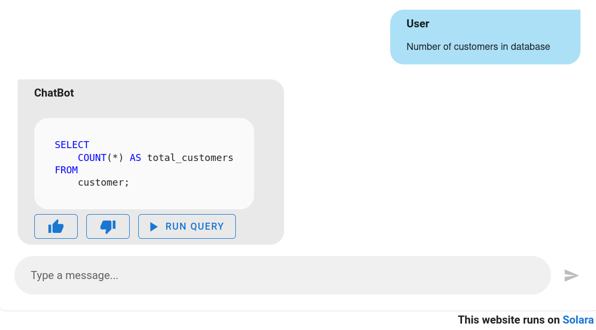
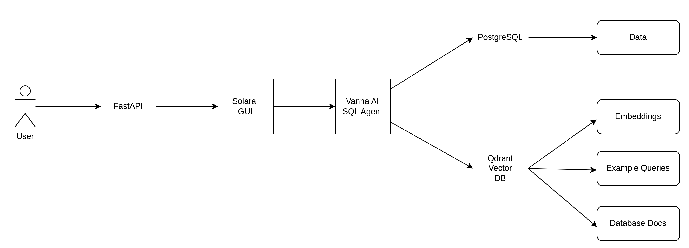

# Solara SQL Chatbot 

This project is a proof-of-concept demonstrating how to create a simple SQL Chatbot using Solara for GUI development, FastAPI as the backend framework, Azure OpenAI API as the language model, Qdrant Vector Database for managing embeddings, PostgreSQL for data storage, and Vanna AI SQL Agent for generating SQL queries from natural language inputs.

<div align="center">
    
</div>

<div align="center">
    <span>Fig.1: Solara Chatbot GUI</span>
</div>


<br>

<div align="center">
    
</div>

<div align="center">
    <span>Fig.2: Components Diagram</span>
</div>

## Table of Contents

- [Install dependencies](#install-dependencies)
- [Environment variables](#environment-variables)
- [Start Docker containers](#start-docker-containers)
- [Create a test database](#create-a-test-database)
- [Run Vanna SQL Agent training](#run-vanna-sql-agent-training)
- [Start the Solara SQL Chatbot](#start-the-solara-sql-chatbot)


## Install dependencies

Create a new Python virtual environment (venv):

```bash
python -m venv .venv
```

Activate the venv:

```bash
# On Linux
source .venv/bin/activate
```

```bash
# On Windows using CMD
.venv\Scripts\activate
```

```bash
# On Windows using Git Bash
source .venv/Scripts/activate
```

Install Python dependencies:

```bash
pip install -r requirements.txt
```

## Environment variables

Create a `.env` file and add the environment variables:

```ini
# PostgreSQL
POSTGRES_USER=postgres
POSTGRES_PASSWORD=postgres
POSTGRES_DB=sales_db
POSTGRES_HOST=localhost
POSTGRES_PORT=5432

# Qdrant
QDRANT__SERVICE__API_KEY=api-key-readwrite
QDRANT__SERVICE__READ_ONLY_API_KEY=api-key-readonly

# Azure OpenAI
AZURE_OPENAI_MODEL_DEPLOYMENT='model-deployment-name'
AZURE_OPENAI_ENDPOINT='openai-endpoint'
AZURE_OPENAI_API_VERSION='openai-api-version'
```

## Start Docker containers

```bash
docker-compose up -d
```

`sales_db` PostgreSQL database will be created

## Create a test database

The python script `db/utils/data_gen.py` will create `customer`and `purchase` tables in `sales_db` database, and finally fill the tables with random data.

```bash
python db/utils/data_gen.py
```

## Run Vanna SQL Agent training

Vanna SQL Agent should be trained only once:

```bash
python db/vanna/vanna_train.py
```

## Start the Solara SQL Chatbot

Option 1: Run the standalone Solara app:

```bash
solara run gui/sol.py
```

The app will be available at `http://localhost:8765`

Option 2: Embed the Solara GUI into a FastAPI app:

```bash
SOLARA_APP=gui/sol.py uvicorn app:app
```

The app will be available at `http://localhost:8000/solara/`
