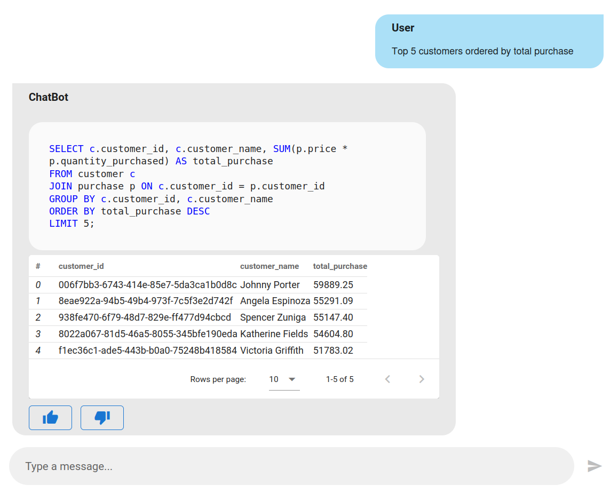

# Solara SQL Chatbot 

Solara SQL Chatbot App using Azure OpenAI models

<div align="center">
    
</div>

## Table of Contents

- [Install dependencies](#install-dependencies)
- [Environment variables](#environment-variables)
- [Start docker images](#start-docker-images)
- [Run Vanna SQL Agent training](#run-vanna-sql-agent-training)
- [Start the app](#start-the-app)
    - [Option 1: Run the standalone Solara app](#option-1-run-the-standalone-solara-app)
    - [Option 2: Embedd the Solara GUI into FastAPI app](#option-2-embedd-the-solara-app-into-fastapi-app)

## Install dependencies

Create a new python virtual environemnt (venv)

```bash
python -m venv .venv
```


Activate the venv

```bash
# On Linux
source .venv/bin/activate
```

```bash
# On Windows using CMD
.venv\Scripts\activate
```

```bash
# On Windows using Git Bash
source .venv/Scripts/activate
```

Install python dependencies

```bash
pip install -r requirements.txt
```

## Environment variables

Create `.env` file and add the env variables to it:

```ini
# PostgreSQL
POSTGRES_USER=postgres
POSTGRES_PASSWORD=postgres
POSTGRES_DB=sales_db
POSTGRES_HOST=localhost
POSTGRES_PORT=5432

# Qdrant
QDRANT__SERVICE__API_KEY=api-key-readwrite
QDRANT__SERVICE__READ_ONLY_API_KEY=api-key-readonly

# Azure OpenAI
AZURE_OPENAI_MODEL_DEPLOYMENT='model-deployment-name'
AZURE_OPENAI_ENDPOINT='openai-endpoint'
AZURE_OPENAI_API_VERSION='openai-api-version'
```

## Start docker images

```bash
docker-compose up -d
```

## Run Vanna SQL Agent training

Vanna SQL Agent should be trained only once

```bash
python db/vanna/vanna_train.py
```

## Start the app

Option 1: Run the standalone Solara app

```bash
solara run sol.py 
```

The app will be available at `http://localhost:8765`

Option 2: Embedd the Solara GUI into FastAPI app

```bash
SOLARA_APP=gui/sol.py uvicorn app:app
```
The app will be available at `http://localhost:8000/solara/`
